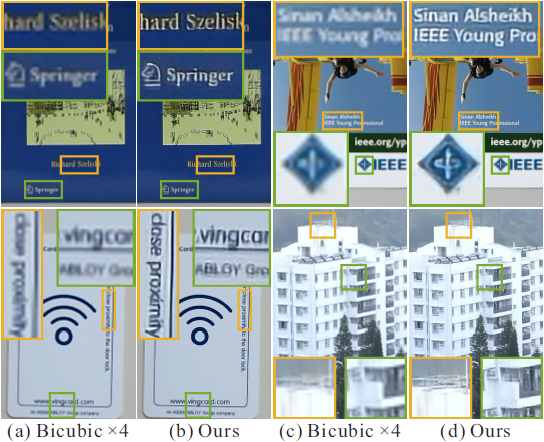
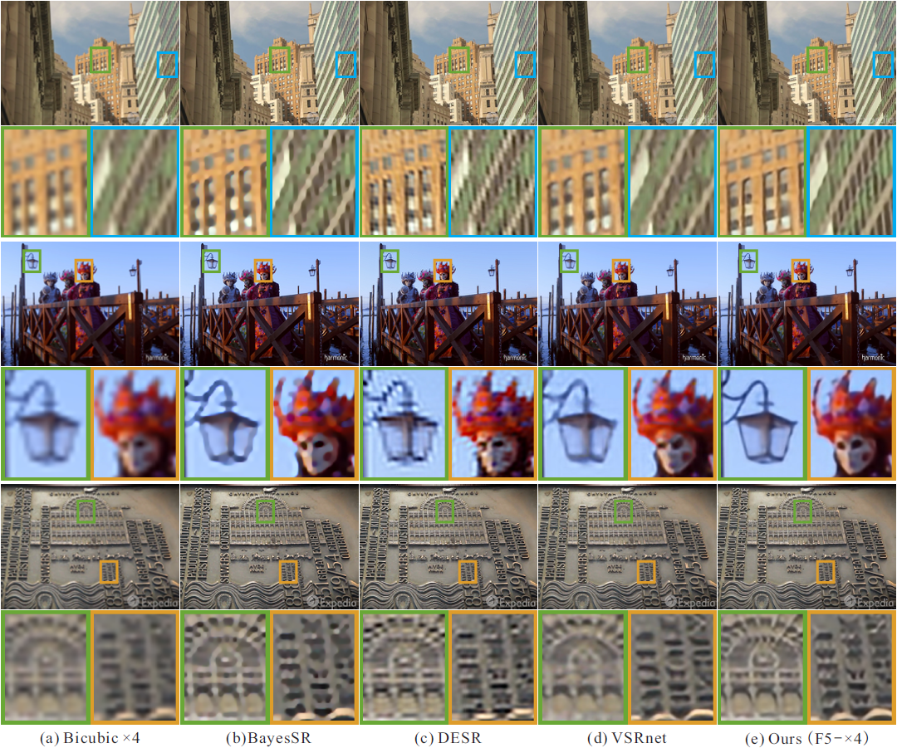

# Detail-revealing Deep Video Super-resolution
by [Xin Tao](http://www.xtao.website), Hongyun Gao, [Renjie Liao](http://www.cs.toronto.edu/~rjliao/), [Jue Wang](http://juew.org), [Jiaya Jia](http://www.cse.cuhk.edu.hk/leojia/). ([pdf](https://arxiv.org/abs/1704.02738))

Our results on real data:

Our results compared with other state-of-the-arts:

## Code v0.1
Currently, we release our research code for testing.
It should produce the same results as in the paper for scale factor `x2` & `x4` and frame number `3`.

## SPMCS Dataset
We have release the testing set of SPMCS. [download](https://tinyurl.com/y7prfsgd)

It consists `30` different videos, each of them contains `31` frames.

Each sequence contains bicubic downsampled input for `x2`, `x3`, `x4` scale factors. Folder `truth` contains high-resolution ground truth image for calculating PSNR and SSIM.

Since many previous methods use `31` frames to produce one result for central frame, we also evaluate quantative result only for the central frame (the number in our paper). We do not crop boundary or use other postprocessing. 

We evaluete PSNR and SSIM only for Y channel of YUV color space. 

### Testing
It would be very easy to understand the `test()` function and test on your own data.

### Training
We will update the code for training and better reading after recent paper deadline.

## Video Results
Here we provide video results for `15` sequences for visual and quantitative comparisons.
[videos](https://tinyurl.com/kyorzps)
[pngs](https://tinyurl.com/y8d7w3gw) 

## Citation

If you use any part of our code, or SPMC video SR is useful for your research, please consider citing:

    @InProceedings{tao2017spmc,
      author    = {Xin Tao and
                   Hongyun Gao and
                   Renjie Liao and
                   Jue Wang and
                   Jiaya Jia},
      title = {Detail-Revealing Deep Video Super-Resolution},
      booktitle = {The IEEE International Conference on Computer Vision (ICCV)},
      month = {Oct},
      year = {2017}
    }

## Contact
We are glad to hear if you have any suggestions, questions about implementation or sequences for testing.

Please send email to xtao@cse.cuhk.edu.hk
